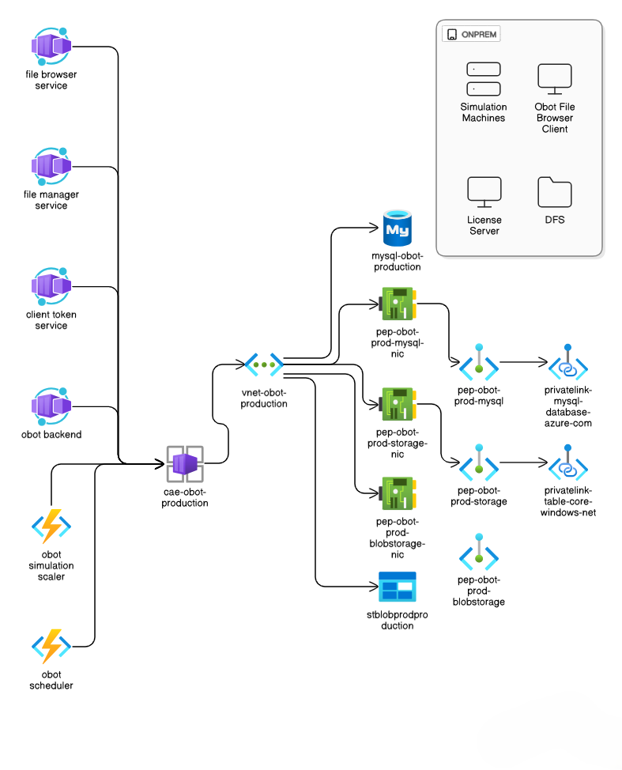
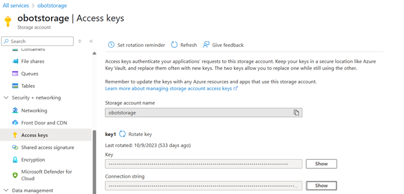
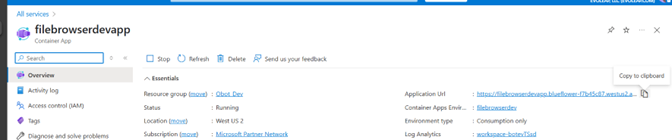
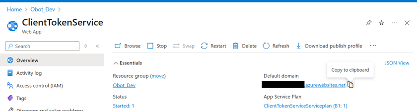
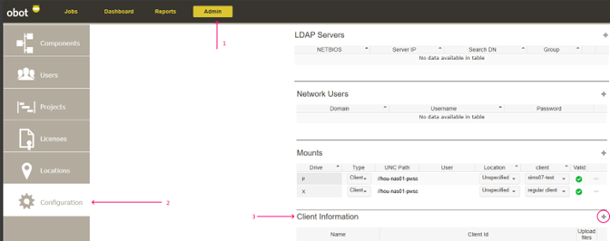
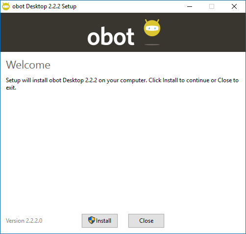
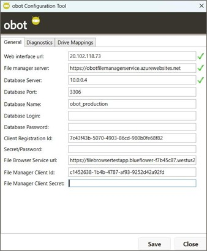

# obot Installation Instructions (Cloud Deployment)

**Version:** 3.x  
**Author:** evoleap, LLC  
**Address:** 10333 Richmond Ave, Suite 450, Houston, TX 77042  
**Phone:** 832-371-6677  
**Year:** 2025

---

## Table of Contents

- [Summary](#summary)
- [Version](#version)
- [Audience](#audience)
- [Roadmap](#roadmap)
- [obot Services](#obot-services)
  - [Terminology](#terminology)
- [Deployment Variations](#deployment-variations)
- [Azure Environment and Services](#azure-environment-and-services)
- [obot Services Overview and Deployment Modes](#obot-services-overview-and-deployment-modes)
- [Deploying Individual obot Services](#deploying-individual-obot-services)
- [Configuring the obot Server](#configuring-the-obot-server)
- [Installing and Configuring Other obot Components](#installing-and-configuring-other-obot-components)

---

## Summary

obot is a product composed of multiple components that are deployed in a distributed environment. The purpose of this document is to explain requirements and deployment scenarios for obot as well as step-by-step installation of individual components in Microsoft Azure.

obot is a workflow orchestration and automation platform for running OLGA simulations in a controlled and auditable manner. It supports job queueing, prioritization, license-aware dispatching, and centralized configuration of simulation environments spread across multiple regions and networks. The system is composed of web-based and containerized backend services, Windows services running on simulation machines, and optional on-premises components for browsing and staging simulation files.

This document explains how to deploy obot version 3.x in Azure using **Azure Container Apps for all containerized workloads** and Azure Database for MySQL Flexible Server for persistent storage. The deployment pattern is designed for production environments that require isolated networking via Azure Virtual Networks and private endpoints, as well as integration with on-premises file shares and license servers. All services are deployed into a dedicated resource group and a **single Container Apps Environment** that is integrated with a virtual network.

---

## Version

This installation manual is applicable to version 3.x of obot with the primary services deployed in the cloud using **Azure Container Apps**. The scheduler and optional simscaler are now deployed as containerized functions rather than Windows services.

---

## Audience

This installation manual is intended to be read by IT professionals, cloud architects, and DevOps engineers responsible for deploying and operating obot in Azure. The document assumes that the reader is familiar with deployment of services and networking in Azure, Azure Container Apps, and containerized application deployments.

---

## Roadmap

The next section includes definitions of key terms and services that will help with reading the rest of the document. Then, various deployment scenarios for obot are discussed. Following this, recommended Azure infrastructure and services are described, updated to reflect a fully containerized deployment under a single Container Apps Environment. Installation and initial configuration required for each obot component is explained in detail.

---

## obot Services

The following diagram shows the typical deployment scenario for obot in Azure. To help understand the rest of this document, key terms and service definitions are provided below.



### Terminology

**DFS (Distributed File System):** A traditional Network Attached Storage (NAS) or Storage Area Network (SAN) device where simulation input files and results are meant to be stored. This typically resides on-premises but can also be Azure Files or other SMB-compatible storage reachable from simulation machines.

**License Server:** The computer running the FlexLM license management system, which holds the license keys for the OLGA software. This is usually on-premises but can be cloud-deployed if simulation machines have network access to it.

**Simulation Machine:** A designated compute machine running Windows and with one or more versions of OLGA installed. Simulation machines may be physical workstations or virtual machines, located on-premises or in Azure.

**File Manager Service:** A containerized REST API service that allows obot to run simulations on cloud simulation machines that do not have access to the DFS. It uses Azure Blob Storage and Table Storage for temporary file staging and metadata.

**Client Token Service:** A containerized service that creates a client ID and key (secret) that can be used to authenticate calls between various obot services and clients. Secrets are hashed and never stored in plaintext.

**File Browser Service:** A containerized service that uses gRPC-based communications with the file browser client to enable the obot backend to browse network shares not directly visible to cloud resources.

**obot Launcher:** A Windows service installed on each simulation machine that downloads simulation inputs, launches OLGA, monitors execution, and uploads results back to the file manager service.

**obot License Monitor:** A Windows service that communicates with FlexLM and monitors availability of licenses for OLGA and associated modules. It provides this information to the scheduler.

**obot Scheduler:** **Now implemented as an Azure Container App function** (no longer a Windows service). It monitors the queue of jobs submitted by users through obot and license availability, and sends launch instructions based on licenses and job priorities. The scheduler runs periodically within the container apps environment and connects to the same MySQL database as the rest of the system.

**obot Desktop:** A Windows application and shell extension that allows users to submit local files to the obot queue and monitor job status from their desktop.

**obot Backend:** A containerized Ruby on Rails application that serves the web UI for obot. It exposes HTTP/HTTPS endpoints for users and other services to interact with obot. The backend can be deployed as an Azure Container App (recommended) or on an Ubuntu VM in specialized scenarios.

**obot Simulation Scaler (Optional):** An optional containerized Azure Function that provides a single REST endpoint returning information about the maximum number of simulations that can be run at a given moment based on the job queue and license limitations. This service is designed for scenarios where customers run simulation machines in the cloud and want to scale them dynamically for cost management. The obot simscaler is deployed in the same Container Apps Environment as other services and is **only useful when simulation machines are cloud-based and elastic**.

---

## Deployment Variations

### Variation #1 — Use evoleap's Multitenant Client Token Service

The Client Token Service issues a client ID and secret that is only returned to the requester once. The secret is never stored directly but only a hash of it is stored. When authenticating client requests, only the hash is checked, and therefore it is perfectly safe for any obot customer to use evoleap's client token service and skip deploying it separately in their own tenant. To use evoleap's multitenant Client Token Service, use the address `https://clienttokenservice.azurewebsites.net` wherever the client token service address is needed.

### Variation #2 — Skip File Browser Service, File Browser Client, and File Manager Service

If it is possible for the simulation machines and obot backend to have direct access to the DFS via SMB2 protocol, then we can skip installation of the file browser and file manager services. In the obot UI, it is possible to add one or more network user account credentials and use these credentials to access specific DFS file shares if there is a virtual gateway to the DFS and network security policies allow the creation of such a utility/service account with limited access to the file shares.

**Important considerations:** The network access speed must be adequate. In this scenario, OLGA runs on simulation machines in the cloud and accesses network shares directly. If access speeds are low or there is significant network latency, this configuration is not recommended, especially if simulation times are low. Many OLGA users run very short simulations (order of seconds), and for such simulations, accessing input files over a wide-area network (WAN) connection could add significant time delays.

### Variation #3 — Cloud-Only Simulation with Dynamic Scaling via simscaler

When simulation machines are deployed exclusively in Azure and scaled dynamically, the optional **simscaler** service becomes useful. simscaler exposes a REST endpoint that reports the maximum number of simulations that can run based on current job queue and license availability. Customers can integrate this endpoint into their scaling logic for VM scale sets or other orchestration tools to automatically scale simulation capacity up or down based on demand.

---

## Azure Environment and Services

Before obot services are deployed, it is recommended that the Azure environment for deploying the services be prepared in advance. The environment includes resource group, storage accounts, virtual networks, subnets, databases, and virtual machines as needed. The details are provided in this section, updated to reflect the reference production deployment `rg-obot-production`.

### Resource Group

It is recommended that obot services be deployed in their own resource group. There are no specific requirements with respect to the creation of the resource group. Customers are free to choose the region in which to deploy the resource group and follow their naming conventions. The example assumes a resource group named `rg-obot-production`.

### Virtual Network

An Azure virtual network must be created so that obot services can communicate between each other without having to send the traffic through the internet. A CIDR address space of **10.0.0.0/16** is recommended, which provides room for multiple delegated subnets within this Virtual Network.

The virtual network is divided into the following subnets:

| Subnet Name | Address Prefix | Delegation | Purpose |
|-------------|---|---|---|
| `default` | 10.0.0.0/24 | None | General purpose subnet with Microsoft.Storage service endpoint |
| `subnet-obot-prod-mysql` | 10.0.1.0/24 | None | Private endpoints for Azure Database for MySQL Flexible Server |
| `subnet-obot-prod-storage` | 10.0.2.0/24 | None | Private endpoints for Azure Storage (blob and general storage) |
| `subnet-obot-prod-cae` | 10.0.3.0/24 | Microsoft.App/environments | Delegated subnet for Azure Container Apps Environment hosting all containerized obot services |

The **default subnet** is an undelegated subnet that can host general workloads and includes a Microsoft.Storage service endpoint for regional access to Azure Storage.

The **subnet-obot-prod-mysql subnet** hosts a private endpoint for the MySQL Flexible Server instance used by obot. Network interfaces for private endpoints are attached to this subnet.

The **subnet-obot-prod-storage subnet** hosts private endpoints for the obot storage account, including blob storage and general storage endpoints used by file manager and other services.

The **subnet-obot-prod-cae subnet** is delegated to `Microsoft.App/environments`, allowing the Container Apps Environment to be created and integrated with this subnet for private networking. A service association link named `legionservicelink` is configured on this subnet to ensure proper association.

**Private DNS Configuration:** Private DNS zones are configured to resolve private endpoints for MySQL, Blob Storage, and Table/Queue storage, allowing container apps to reach these services using standard FQDNs over the virtual network:
- `privatelink.mysql.database.azure.com`
- `privatelink.blob.core.windows.net`
- `privatelink.table.core.windows.net`

### Storage Account

obot requires a storage account for the file manager service and client token service. This storage can also optionally be used to store server logs from the obot backend server.

**Configuration recommendations:**

1. **Basics Tab:** The primary service should be Azure Blob Storage. Performance setting of Standard is sufficient, and locally redundant storage is sufficient. The storage account should use the Hot tier for frequent access to simulation data.

2. **Advanced Tab:** Default security settings are sufficient, but customers may configure other options based on their data and security policies.

3. **Networking:** Public network access may be disabled as this storage account is not accessed directly over the internet. A private endpoint should be added and placed on the `subnet-obot-prod-storage` subnet of the virtual network created in the previous step.

When configuring connection strings for obot services, substitute the end of the connection string from `core.windows.net` to the appropriate `privatelink` domain (e.g., `privatelink.blob.core.windows.net`).

### Azure Database for MySQL

If there does not already exist an Azure Database for MySQL in the target tenant, a new Flexible Server for Azure Database for MySQL should be created.

**Configuration recommendations:**

1. **Basics Tab:** Select the newly created resource group and MySQL version 8.0. If the server is only for obot, the workload type of "Small or medium size databases" is sufficient. Availability zone choices are up to the customer. For authentication, use MySQL authentication (not Entra ID) so that credentials can be provided to the obot services.

2. **Networking Tab:** The choice of whether to allow public access depends on where obot services will be deployed. Since this document assumes all backend services run within the VNet as container apps, public access is not necessary. Use the create private endpoint option to attach the database to the `subnet-obot-prod-mysql` subnet. If public access is allowed, firewall rules should restrict access to specific IP address ranges.

For all other settings, customers are free to choose based on their data and security policies.

### Virtual Machines

There are two to three classes of virtual machines that potentially get deployed in the obot resource group.

1. **Windows Server VM for Windows Services:** A Windows Server VM for deploying the singleton instance of obot license monitor (the scheduler is now containerized). This VM can be a general purpose (D-series or similar) VM with 2-4 vCPUs and 16-32 GB RAM. If obot desktop is deployed, it may need to access the database, so ensure this VM has appropriate network access to the MySQL database.

2. **Simulation Machines:** One or more Windows Server or workstation VMs that are compute-optimized. Since OLGA simulations do not scale well past 8 threads, there is a choice to either have multiple smaller CPU count VMs or use fewer high CPU-count workstations that run more simulations in parallel. The correct choice varies based on organization and available OLGA licenses.

All VMs shall be configured to connect to the virtual network previously configured.

### Container Apps Environment

A **single Container Apps Environment** must be created to host all containerized obot services: File Browser service, Client Token Service, File Manager Service, obot backend, scheduler, and optional simscaler.

**Key Configuration:**

- The environment must be integrated with the `subnet-obot-prod-cae` subnet, which is delegated to `Microsoft.App/environments`.
- Virtual network integration enables secure private networking where services can reach MySQL and storage via private endpoints.
- Public ingress can be enabled for selected apps (like obot backend) to serve users, or disabled if using an Application Gateway or private access only.
- Workload profiles should be configured to provide dedicated compute capacity for backend and scheduler, while using consumption tiers for lighter services like file browser and token service.
- Environment logs should be sent to an appropriate Log Analytics workspace for monitoring.

---

## obot Services Overview and Deployment Modes

All containerized obot services are deployed as Azure Container Apps in the single Container Apps Environment. Windows services are limited to on-premises or cloud simulation machines and the license monitor. The following table summarizes key services, their deployment artifacts, deployment modes, and primary environment variables.

| Service | Deployment Package | Deployment Mode | Environment Variables |
|---|---|---|---|
| File Browser | `evoleap.azurecr.io/evoleap/filebrowserservice:latest` | Container App | `PartitionKey`, `ConnectionStrings__AzureStorage` |
| Client Token Service | `evoleap.azurecr.io/evoleap/clienttokenservice:latest` | Container App | `ASPNETCORE_FORWARDEDHEADERS_ENABLED`, `ConnectionStrings__AzureStorage`, `FileBrowserUrl`, `ValidationToken` |
| File Manager | `evoleap.azurecr.io/evoleap/obotfilemanagerapi:latest` | Container App | `AuthenticationEndpoint`, `BlobContainerInfo__Name`, `ConnectionStrings__AzureBlobStorage`, `ConnectionStrings__Database`, `StorageDirectory` |
| obot Backend | `evoleap.azurecr.io/evoleap/obot:latest` | Container App | `OBOT_DB_NAME`, `OBOT_DB_PASSWORD`, `OBOT_DB_SERVER`, `OBOT_DB_USE_SSL`, `OBOT_DB_USER`, `OBOT_SSL_CA`, `OBOT_URL`, `RAILS_ENV`, `RAILS_SERVE_STATIC_FILES`, `TOKEN_SER_URL`, `TOKEN_SER_KEY` |
| obot Scheduler | `evoleap.azurecr.io/obotscheduler-function:latest` | Container App Function | See [Scheduler Environment Variables](#scheduler-environment-variables) |
| simscaler (Optional) | `evoleap.azurecr.io/obotsimscaler-function:latest` | Container App Function | Database connection, storage URIs, telemetry configuration |
| obot License Monitor | `obot_services_setup.exe` | Windows Service | Configured via obot Settings utility |
| obot Launcher | `obot_services_setup.exe` | Windows Service | Configured via obot Settings utility |
| obot Desktop | `obot_desktop_setup.exe` | Windows Desktop Application | Configured via obot Settings utility |

---

## Deploying Individual obot Services

### File Browser Service

The obot file browser service allows the obot backend service to browse network shares not directly visible to the cloud resources via the obot File Browser Client services running inside the intranet. When the obot File Browser Client service starts up, it establishes a bidirectional communication channel to the obot File Browser service over secure HTTP/2 using gRPC.

The obot File Browser service requires a **PartitionKey** environment variable that is typically set to the obot backend server's DNS name. Since the Client Token Service is designed as a multi-tenant application, this partition key allows the file browser service to authenticate API calls related to a specific obot backend.

**Deployment Settings:**

1. **Basics**
   - Deployment source: "Container image"
   - If a Container Apps Environment has not been created already, click on "Create new environment" and follow the guidelines outlined in the previous section.

2. **Container**
   - Image source: Docker Hub or other registries
   - Registry login server: `evoleap.azurecr.io`
   - Use the username and password for the registry provided
   - Image and tag: `evoleap/filebrowserservice:latest`
   - CPU and memory: 0.5 CPU cores and 1 Gi memory
   - Environment variables:
     - `PartitionKey`: `<DNS Name of obot backend>`
     - `ConnectionStrings__AzureStorage`: (See connection string instructions below)

3. **Ingress** — Enabled
   - Transport: HTTP/2

To obtain the connection string for the storage account, navigate to the storage account's "Access Keys" section and click "Show" next to the Connection String. Copy and paste this value. **Important:** Substitute the end of the connection string from `core.windows.net` to `privatelink.blob.core.windows.net` (or the appropriate privatelink domain).



### Client Token Service

The Client Token Service acts as an authenticator for intra-service communication. It achieves this by creating client IDs and secrets that can be shared between services when they communicate with each other. Figure 3 shows an example of how the Client Token Service is used to validate that each obot file browser client is authorized to register with the obot file browser service. The Client ID issued by the Client Token Service is also then used to identify the specific File Browser Client to be used for getting folder listings by the obot backend.

In addition to this primary function, the client token service also acts as a RESTful passthrough service to the obot file browser service that only communicates via gRPC.

**Deployment Settings (Container App):**

1. **Basics**
   - Deployment source: "Container image"
   - If a Container Apps Environment has not been created already, create one following the guidelines.

2. **Container**
   - Image source: Other container registries
   - Access Type: Private
   - Registry server URL: `evoleap.azurecr.io`
   - Use the username and password for the registry provided
   - Image and tag: `evoleap/clienttokenservice:latest`
   - CPU and memory: 0.5 CPU cores and 1 Gi memory

3. **Networking**
   - Enable public access: On (if File Browser Client cannot resolve internal DNS name)
   - Enable virtual network integration: On (if File Browser Client can resolve internal DNS name)

The preference is to disable public access and enable virtual network integration. However, it must be ensured that the on-premises File Browser Client services are able to access the client token service endpoint through the virtual network gateway. If this is not feasible, enable public access and disable virtual network integration.

Once the Container App is deployed, configure the following environment variables:

| Variable | Value |
|---|---|
| `ASPNETCORE_FORWARDEDHEADERS_ENABLED` | `True` |
| `ConnectionStrings__AzureStorage` | (See storage account connection string instructions) |
| `FileBrowserUrl` | (See instructions below) |
| `ValidationToken` | (Any randomly generated GUID) |

To obtain the **FileBrowserUrl** value, navigate to the File Browser Container App and copy the Application URL under the Essentials section in the Overview page.



### File Manager Service

The obot File Manager Service provides a REST API for obot services to temporarily store and retrieve simulation files. When the simulation machines do not have direct access to the location of the simulation files, the file browser client uploads the simulation input file and any associated files referenced by the input file to the file manager. When the simulation is launched, the obot launcher service on the simulation machine (whichever one is designated by obot scheduler to run the simulation in question) will download these files and extract them to a temporary folder in `%PROGRAMDATA%\evoleap\launcher\storage`. Then, the launcher will launch OLGA at this temporary location. Once the simulation is finished, the obot launcher will zip and upload the contents of the folder back to the file manager. When results are available, the file browser client will download the results and zip any new files (not included in the original upload) to the same location as the original input file.

**Deployment Settings (Container App):**

1. **Basics**
   - Deployment source: "Container image"

2. **Container**
   - Image source: Other container registries
   - Registry server URL: `evoleap.azurecr.io`
   - Use the username and password for the registry provided
   - Image and tag: `evoleap/obotfilemanagerapi:latest`
   - CPU and memory: 0.5 CPU cores and 1 Gi memory

3. **Networking**
   - Enable public access: On (if File Browser Client cannot resolve internal DNS name)
   - Enable virtual network integration: On (if File Browser Client can resolve internal DNS name)

The settings for this container app are exactly the same as for the obot Client Token Service, except for the container image and tag.

Once the Container App is deployed, configure the following environment variables:

| Variable | Value |
|---|---|
| `AuthenticationEndpoint` | (Client Token Service URL) |
| `BlobContainerInfo__Name` | Any string (default=obotblobstorage) |
| `ConnectionStrings__AzureBlobStorage` | (Storage account connection string) |
| `ConnectionStrings__Database` | (Storage account connection string for table storage) |
| `StorageDirectory` | Any string (default=filemanager) |

Environment variables with default values do not need to be added if you are comfortable with the defaults. It is recommended that the same connection string be used for both blob storage and database (table storage).

To obtain the **AuthenticationEndpoint** value, navigate to the Client Token Service Container App and copy its Application URL.



### obot Backend Server

The obot backend server is distributed as a container and serves the web UI for the users to submit and monitor their jobs. obot can be deployed as an Azure Container App. obot runs a web server exposed by default on port 3000, which can be mapped to the secure HTTPS port 443 of a container app. Since users access the obot UI via this web server, it needs to be exposed either via a public IP or the appropriate network gateway and DNS configurations. This document does not cover the network and DNS configuration to make this application accessible to users as the specifics of that configuration depend on the customers' network setup.

**Deployment Settings (Container App):**

1. **Basics**
   - Deployment source: "Container image"
   - If a Container Apps Environment has not been created already, click on "Create new environment" and follow the guidelines outlined in the previous section.

2. **Container**
   - Image source: Docker Hub or other registries
   - Registry login server: `evoleap.azurecr.io`
   - Use the username and password for the registry provided
   - Image and tag: `evoleap/obot:latest`
   - CPU and memory: 1 CPU core and 2 Gi memory (per scale instance)
   - Environment variables: (See table below and deployment screenshots)

3. **Ingress** — Enabled
   - Ingress type: HTTP
   - Transport: Auto
   - Target port: 3000

| Variable | Value |
|---|---|
| `OBOT_DB_NAME` | `obotdatabase` |
| `OBOT_DB_PASSWORD` | `<MySQL server password>` |
| `OBOT_DB_SERVER` | `<MySQL server hostname or IP>` |
| `OBOT_DB_USE_SSL` | `True` |
| `OBOT_DB_USER` | `<MySQL database user>` |
| `OBOT_SSL_CA` | `./certs/combined-ca-certificates.pem` |
| `OBOT_URL` | `<same as PartitionKey in File Browser service>` |
| `RAILS_ENV` | `production` |
| `RAILS_SERVE_STATIC_FILES` | `True` |
| `TOKEN_SER_URL` | (Client Token Service URL or `https://clienttokenservice.azurewebsites.net`) |
| `TOKEN_SER_KEY` | `<same as ValidationToken in Client Token Service>` |

### obot Scheduler (Container App Function)

The obot scheduler monitors the job queue and license availability, and sends launch instructions to simulation machines based on licenses and job priorities. **Unlike previous versions, the scheduler is now deployed as a containerized function within the same Container Apps Environment as other obot services.**

The scheduler runs on a timer trigger (typically every 15 seconds) and queries the MySQL database to:
- Check for pending jobs in the queue
- Query license availability from the license monitor
- Determine which simulations can be launched
- Create launch instructions for available simulation machines

**Deployment Approach:**

The scheduler is deployed as an Azure Container App Function using the container image provided. It requires access to:
- The obot MySQL database
- Azure Storage for job state and metadata
- Application Insights for monitoring and telemetry
- The license monitor service for license availability information

**Environment Variables:**

| Variable | Description | Example Value |
|---|---|---|
| `APPLICATIONINSIGHTS_AUTHENTICATION_STRING` | Authentication string for Application Insights | `ClientId=<GUID>;Authorization=AAD` |
| `APPLICATIONINSIGHTS_CONNECTION_STRING` | Connection string for Application Insights monitoring | `InstrumentationKey=<KEY>;IngestionEndpoint=<URL>;...` |
| `AzureWebJobsStorage__blobServiceUri` | URI for Azure Blob Storage service | `<blob storage url from storage account>` |
| `AzureWebJobsStorage__clientId` | Managed identity client ID for storage access | `<GUID>` |
| `AzureWebJobsStorage__credential` | Credential type | `managedidentity` |
| `AzureWebJobsStorage__queueServiceUri` | URI for Azure Queue Storage service | `<queue storage url from storage account>` |
| `AzureWebJobsStorage__tableServiceUri` | URI for Azure Table Storage service | `<table storage url from storage account>` |
| `DOCKER_REGISTRY_SERVER_URL` | URL of the Docker container registry | `evoleap.azurecr.io` |
| `DOCKER_REGISTRY_SERVER_USERNAME` | Username for Docker registry authentication | `evoleap` |
| `FUNCTIONS_EXTENSION_VERSION` | Azure Functions runtime version | `~4` |
| `TIMER_SCHEDULE` | Cron expression for scheduler timer trigger | `0/15 * * * * *` (every 15 seconds) |
| `WEBSITES_ENABLE_APP_SERVICE_STORAGE` | Enable or disable App Service storage (should be false for containers) | `false` |

**Secrets (Not Documented Here):**

The following variables contain sensitive information and should be stored securely (e.g., Azure Key Vault):
- `ConnectionStrings__obotdbEntities` (MySQL connection string)
- `DOCKER_REGISTRY_SERVER_PASSWORD`
- `WEBSITE_AUTH_ENCRYPTION_KEY`

Store and reference these through Azure Key Vault or other secure secret management mechanisms.

### simscaler (Optional Container App Function)

The **simscaler** service is an optional containerized function designed for customers running simulation machines in the cloud with dynamic scaling requirements. It provides a single REST endpoint that returns information about the maximum number of simulations that can run at the current moment based on the job queue and license limitations.

**Use Cases:**

simscaler is useful only in the following scenarios:
- Simulation machines are deployed exclusively in Azure (not on-premises)
- Simulation machine infrastructure is elastic (e.g., VM scale sets)
- You want to automatically scale simulation capacity based on current demand

**Deployment Approach:**

simscaler is deployed as an Azure Container App Function in the same Container Apps Environment as the scheduler and other services. It uses the same MySQL database and license information as the scheduler.

**REST API:**

The endpoint exposes a simple query interface:
```
GET /api/CalculateMaxParallelSimulations
```

Response:
```json
{
  "maxParallellSimulations": 10,
  "limitingFactor": "string reason",
  "details": {
     "activeJobCount": 5,
     "queuedCaseCount": 25,
     "runningSimulationCount": 5,
     "totalSimulationCapacity" : 20,
     "totalLicenseCapacity": 10,
     "runningLicenseUsage": {
        "olga": 5,
        "wells": 2,
        "olga_comptrack": 1
     },
     "availableLicenseCapacity": {
        "olga": 5,
        "wells": 3,
        "olga_comptrack": 2
     }
  }
}
```

Customers can integrate this endpoint into their scaling logic for Azure VM Scale Sets or other orchestration tools to automatically provision or deprovision simulation machines.

**Configuration:**

simscaler requires similar environment variables to the scheduler:
- Azure Storage URIs (blob, queue, table)
- MySQL database connection string
- Application Insights telemetry
- Docker registry credentials

---

## Configuring the obot Server

There are a few different configuration settings that need to be customized for your deployment. These include:

- Creating one or more client IDs and secrets
- Setting up the network paths where simulation inputs and outputs are located and associating them with the clients

In order to do this, you will need to log on to the obot backend server via a browser using the default admin account (username: **admin**, password: **password**). Navigate to the **Configuration** section of the Admin page.



### Creating Client IDs and Secrets

Client IDs and secrets allow obot services to communicate between each other in a secure manner. A client ID and secret is a pair of GUIDs generated at random by the Client Token Service. In the Client Information table, press the **+** button to bring up the dialog box to create a new ID-secret pair. Give the pair a descriptive name. Clicking the **Create** button will send the request to the Client Token Service and the newly generated ID and secret will be shown. Please copy the ID and password and store these in a separate file along with the Client name for future reference.

**[INSERT IMAGE HERE: Dialog for creating a new ID-secret pair]**

Generate one client ID and secret for each of the File Browser clients you plan to install — typically, one per region. If the deployment plan calls for using the File Manager to upload files from the file browser clients, generate a unique ID-secret pair for the File Manager service. If the File Browser is being used to upload files, please ensure that the **"Upload Files"** checkbox is checked for those mounts.

The only scenario under which you wouldn't upload files is if the simulation machines are not in the cloud, but are inside your network in each region.

### Creating Mounts

For each file browser client, you would also create one or more **mounts**. These are network file share locations that users in each region use to store their OLGA input files. You can create mounts by pressing the **+** button across from the Mounts table right above the Client Information. For each mount, select a drive letter, select "Client" as the type, pick the client from the dropdown list, and select a location from the dropdown list.

If your locations are not found, navigate to the **Locations** section of the Admin page and create new locations as necessary. Ultimately, users will also get assigned to these locations, and when a user navigates to the new job page, only mounts associated with their location will be browsable.

---

## Installing and Configuring Other obot Components

There are two Windows installers included in obot:
1. **Services Installer:** Installs Windows services (scheduler legacy support, license monitor, launcher)
2. **Desktop Installer:** Installs the obot desktop application and configuration utility

The scheduler and license monitor are typically installed on a separate machine, while the launcher is installed on each simulation machine. The file browser client is typically installed on one machine in the intranet for each region where network shares are visible.

Double-clicking the Services setup utility brings up the screen shown below. You can select the obot components that you want to install on the machine. Please select the appropriate options depending on your deployment scenario.

> **Important:** Please ensure that the obot license monitor is installed only on one machine. There is no check in any obot components or the installer to see if the programs have already been installed on other machines in the network.


Clicking the **"Install"** button will begin the installation of the selected components. The installation will automatically copy the files into the appropriate directories and create the entries in Windows services so that obot components run automatically.

### Desktop Application Installation

The Desktop setup utility installs the obot desktop application and the obot Settings configuration utility. The obot Settings utility is required to configure the address of the obot web and database server so that the services can communicate with the server.



Click **Install** and then the **"Close"** button once the installation is done.

### Configuring obot Settings

Once the desktop application is installed, launch the **obot Settings** app from the Start Menu. Configure the following:



- **Web Interface URL:** Type the fully qualified hostname or IP address (typically prefixed with "https://") of the obot backend container app or VM.
- **File Manager Server:** Enter the hostname or URL of the file manager service container app.
- **Database Details:** Fill in the details of the Azure MySQL database (server, username, password).
- **File Browser Client Configuration** (if applicable): If you installed the File Browser Client service on the machine, type in:
  - Client ID generated in the obot Configuration page
  - Client secret for this particular client
  - File Browser service URL from the container app deployment
- **Launcher and File Browser Client Machines:** Fill in the File Manager client ID and secret pair that was generated in the obot Configuration page.
- **License Monitor and Scheduler Machines:** The last five fields may be left blank (legacy for Windows service scheduler; container app scheduler does not use these settings).

### Additional Configuration for obot Launcher

The obot launcher component alone is not to be run under a service account. Since OLGA runs in a shell and its standard output is required to be captured by obot, the launcher requires a non-service account context so that operations such as writing to standard output are allowed (since OLGA is launched by the launcher, OLGA runs under the same impersonation context as the launcher).

On the machines where the launcher is installed, please open the Windows Services management console by typing **"services.msc"** from the Windows **"Run"** window or going through **Control Panel > System and Security > Administrative Tools > Services**. Locate the **"obot Simulation Launcher"** service in the list and double-click it (or right-click and select **Properties**). In the **"Log On"** tab of the property window, select **"This account"** and type in the non-service account user that has access to the simulation machine and permissions to run OLGA.

---

## Summary

obot is a distributed system designed to orchestrate OLGA simulations across cloud and on-premises infrastructure. This document has outlined the components, deployment patterns, and configuration steps required for a successful obot deployment in Microsoft Azure.

**Key Takeaways:**

1. **Fully Containerized Control Plane:** All backend services (backend, file browser, client token, file manager, scheduler, and optional simscaler) run as Azure Container Apps in a single Container Apps Environment.

2. **Private Networking:** Use Azure Virtual Networks with private endpoints for MySQL and storage to keep traffic off the public internet.

3. **Hybrid Architecture:** The system supports both cloud and on-premises simulation machines through file staging and license monitoring.

4. **Flexible Deployment:** Multiple deployment variations allow customers to tailor the setup to their cost, security, and performance requirements.

5. **Scalability:** The optional simscaler component enables dynamic scaling of cloud simulation machines based on workload and license availability.

For additional support and questions, please contact evoleap at 832-371-6677 or visit the evoleap website.

---

**Document Version:** 3.x  
**Last Updated:** December 2025
